# Backend


| MODULE             | Topic Name                 |
| :---: | :---:  |
| 1 | How the internet works |
|| Server ||
|| What is a web server and how does it work ||
|| What are websites and webpages ||
|| What is a web browser and how does it work ||
|| Web hosting ||
|| Introduction to Internet Protocols||
|| Introduction to HTTP||
|| HTTP Methods||
|| HTTP Request Headers ||
|| HTTP Status Codes ||
| 2 | Python |
|| How is Python used in the real world?||
|| Introduction to Programming ||
|| Python syntax, spaces matter ||
|| Commenting code ||


 The [backend](https://www.geeksforgeeks.org/frontend-vs-backend/) is the server-side of the website. It stores and arranges data, and also makes sure everything on the client-side of the website works fine. It is the part of the website that you cannot see and interact with. It is the portion of software that does not come in direct contact with the users. The parts and characteristics developed by backend designers are indirectly accessed by users through a front-end application. Activities, like writing APIs, creating libraries, and working with system components without user interfaces or even systems of scientific programming, are also included in the backend.
# How the internet works
You open your favorite app on your device and you're instantly connected to the world. This is all made possible because two devices connect and communicate via a wired or wireless connection, forming something called a network. You can connect multiple devices to this network. But this becomes very complicated very quickly, as each device needs to connect to every other device to communicate effectively. This problem is solved by something called a network switch that connects multiple devices and allows them to communicate with each other. The network switch can connect to other network switches, and now two networks can connect. These network switches then connect to more network switches until you have something called an interconnected network. This interconnected network has another name that you might be familiar with. It's called the Internet

## Server
When we use websites or video streaming services on the Internet, these are provided by computers called servers.Our devices are called clients. This is known as the client-server model.  Internet connects the entire world. Have you ever had a video call with someone on another continent? That video data travel through large undersea cables connecting the world's networks. These cables can transfer huge volumes of data per second. There are a lot more technical details that go into making the Internet possible. But this is the main idea

## What is a web server and how does it work
A server is a computer that runs applications and services ranging from websites to instant messaging. It's called a server because it provides a service to another computer and its user also known as the client. Is typically stored in something called a data center with hundreds or thousands of other servers, all running different services connected to the internet. There are many different systems in data centers to ensure that servers have continuous power, continuous internet connection and are kept called 24 hours per day. Did you know that there are data centers located all around the world. Many websites use these to allow you to access your content quickly from the data center nearest to you. The data center servers are built based on the service purpose. For example, if the server is only to be used for storing images, it might have a lot of hard drive space. Whereas a server computing complex calculations might need a fast processor and a lot of memory. This is usually referred to as a server hardware. The physical components of a server. Once the server hardware is installed in the data center, a piece of code can now run. The code that runs on the hardware is commonly known as software. One way I like to remember this is to think of hardware as something you can physically touch and is difficult to change as you need to physically replace components. Software is soft or easy to change. You just replace the code running on the server. `A web server has many functions which includes website storage and administration, data storage, security and managing email. Another primary function is to handle something known as a web request. When you open a browser on your device and type the name of the website, it's the job of the web server to send you back to that website's content. This process is known as the request response cycle. Web servers are also designed to respond to thousands of requests from clients per second.`

## What are websites and webpages
A web page is a document that displays images, texts, videos and other content in the web browser, a website is a collection of webpages that link together.you can open and edit with any text editor, but developers usually use more sophisticated tools for working with webpages. If you want to work with a webpage, you need to know about three technologies and understand how they interact, their HTML, CSS and JavaScript. HTML structures the content you see, CSS controls the colors and style and JavaScript is responsible for the user interaction.HTML stands for hypertext markup language, it works by using something called markup tags. These tags describe the content that is displayed in the browser window, this content can be things like headings, paragraphs, images and even multimedia elements such as audio and video, the way html describes the content is known as markup. CSS is short for cascading style sheets and adds visual enhancements like colors and layout to the web page, this is commonly known as styling.JavaScript provides web developers with tools for interactivity, data processing, control and action. Have you ever tried to log to a website only to be told that the information you provided was incorrect or browse your favorite video streaming site and seen content update in real time? Well, that's JavaScript in action, JavaScript is the powerhouse of a web page. It has the ability to manipulate the content that you see on the screen as you interact with it. In fact, without JavaScript websites would be kind of boring and very limited in terms of what you can do, okay, you now know about the essential technologies of web page contains.`But how exactly does this code get translated to display the content that you see on your screen? When a copy of that webpage is sent from the web server to your browser, each line of code is processed in sequential order from first to last. As each line is interpreted, the browser creates the building blocks, which is the visual representation you see on the screen. This creation process is known as page rendering, the response from the web server must be a complete web page in order to fulfill the request, to show the page in the browser. `
## What is a web browser and how does it work


A web browser, or browser for short, is a software application that you use to browse the World Wide Web. It works by sending a request to a web server and then receives a response containing the content that is to be displayed on the screen of your device. Once the browser is open on your device, there is the address bar where you input the address of the website that you want to visit. The address is commonly known as the `Uniform Resource Locator` or URL for short. The URL contains the protocol or the HTTP, the domain name, usually the name of the website, and the file path, or the path to the page that is displayed. When you make a request using this URL, the browser and server communicate using a protocol known as the Hypertext Transfer Protocol or HTTP.Once the web browser receives the content, it displays it on the screen of your device. This exchange of information is made possible by something known as the request response cycle.


let me demonstrate this using an example many of us are familiar with, searching the web. First, you open a web browser, which is a software application. Next, you type the name of your favorite search engine. The name you type contains something called a domain name. Then when you press Enter, the web browser sends a request across a network and connects to another computer on the Internet called a web server. The web server is a special type of computer that allows other computers to make requests for data. The web server responds by sending a webpage back to the browser. Once the browser receives all the response information, the search engine webpage is made visible. The web page is a coded document that is rendered by the browser and then presented visually to you, the end-user. Now that the search engine webpage is loaded in the browser


## Web hosting
Web hosting is a service where you place your website and files on the hosting companies web server. You're essentially renting the space in return for stable and secure storage. You don't need to be accompanied to use a web host. Individuals can rent space too.
- shared hosting
- virtual private hosting
- dedicated hosting
- Cloud hosting

`shared hosting ==>` The cheapest form of web hosting is known as shared hosting. You pay for a location on a web server containing many web hosting accounts with shared hosting. This means that you also share the service processing power, memory, and bandwidth with other websites that might slow your performance.


`virtual private hosting ==>`A VPS is a virtual server with dedicated CPU, memory, and bandwidth resources. It will be running on a hardware server with other VPS instances but as the resources are fixed per VPS instance, your website is unlikely to be impacted by the performance of other VPS instances. A VPS instance will be more expensive than shared hosting


`dedicated hosting ==>` This will be a hardware server that is dedicated to you only. All hardware, CPU, memory, and bandwidth resources are yours to use. Generally, this option is more expensive than a VPS hosting.


`Cloud hosting ==>`Cloud hosting and the Cloud has grown in popularity over the last decade and is often mentioned in various news and services you use. With Cloud hosting, your website is run in something called a Cloud environment, which spans across multiple physical and virtual servers. If a physical or virtual server fails, your website will run on a different server and stay online. The main advantage of Cloud hosting is that you can use as many resources as you need without hardware limitations. However, you pay based on resource use. For example, if you transfer a file from the Cloud to a web browser, you'll pay for the bandwidth used for that transfer at a fractional cent cost per megabyte


## Question

Is the following statement true or false? The payload part of IP packets supports multiple protocols to make sure that information arrives as expected. Two of these are Transmission Control Protocol (TCP) and User Datagram Protocol (UDP). UDP is used to send data that must arrive correctly and in order.

## Correct
That is correct! TCP is used for data that must arrive correctly and in order. This is because TCP can deal with data packets arriving out of order, becoming damaged or corrupted, or dropped or lost albeit at the cost of a small delay.

## Introduction to Internet Protocols


When you send data between computers across the internet, a common way of understanding that data is needed by the computers and networks that the data travels across. What makes that possible is the Internet Protocol. Version four and version six are currently the two most widely used standards of internet protocol (IP).Think of the old fashioned postal system again when you send a letter to a friend you need their address otherwise they won't receive your letter. Computers work in a similar way. Every computer on a network is assigned an IP address.`In protocol version four an IP address contains four octet. It's separated by periods or dots. For example 192.0.2.235. In protocol version six. An IP address contains eight groups of hexadecimal digits separated by a colon. For example 4527:0a00:1567:0200:ff00:0042:8329.`. When you send data across a network, you send the data as a series of messages called IP packets. Also known as data grams at a high level IP packets contain a header and a payload or the data. Think of that old fashioned postal system again, when you send a letter. You not only include the recipient's address but also your own address in case a return location is needed. IP packets are the same. They include the destination IP address and source IP address. These addresses are in the header along with some additional information to help deliver the packet. And the payload contains the data of the packet and some of the other protocols.
Things can go wrong with the postal system. When sending multiple letters to a friend it's possible they may arrive out of order. It's possible that a package will get damaged or if you're really unlucky a letter could get lost.`These issues can happen to IP packets too they can arrive out of order, become damaged or corrupted to in transit or be dropped or lost during transit. To solve these problems, the payload part of the packets contains other protocols too. You can think of them as another message inside the payload of the IP packet`The two most common protocols are the Transmission Control Protocol referred to as `TCP` and the User Datagram Protocol, also known as `UDP`. TCP can solve all three of the previously mentioned issues but at the cost of a small delay when sending the data. This protocol is used for sending the data that must arrive correctly and in order such as a text or image files.UDP solves the corrupt packet issue but packets can still arrive out of order or not arrive at all. This protocol is used for sending data that can tolerate some data loss such as voice calls or live video streaming. Both of these protocols contain payloads that contain further protocols inside of them and there you have it.
## Introduction to HTTP
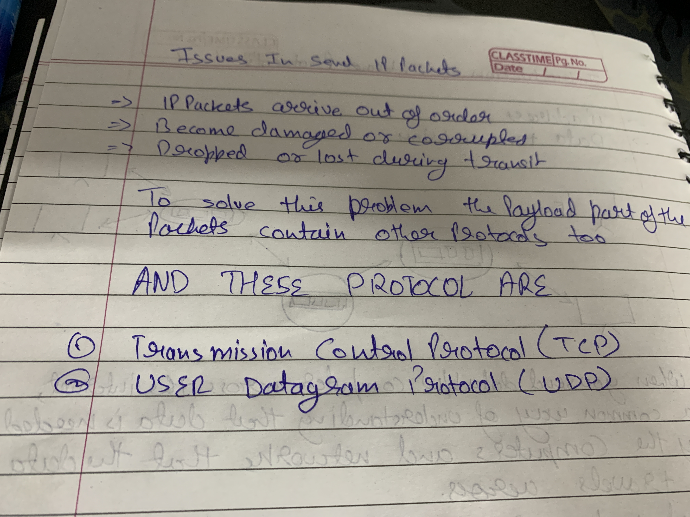
HTTP is a core operational protocol of the world wide web. It is what enables your web browser to communicate with a web server that hosts a website. HTTP is the communication protocol you use whenever you browse the web. HTTP stands for Hypertext Transfer Protocol is a protocol used for transferring web resources such as HTML documents, images, styles, and other files. HTTP is a request response based protocol. A web browser or client sends an HTTP request to a server, and the webserver sends the HTTP response back to the browser

## HTTP examples
This reading explores the contents of HTTP requests and responses in more depth.

### Request Line
Every HTTP request begins with the request line.

This consists of the HTTP method, the requested resource and the HTTP protocol version.

`GET /home.html HTTP/1.1 `

In this example,   `GET` is the HTTP method, `/home.html` is the resource requested and HTTP 1.1 is the protocol used.

### HTTP Methods
HTTP methods indicate the action that the client wishes to perform on the web server resource.

Common HTTP methods are:
|HTTP Method    | Description      | 
| ------------- | ------------- | 
| GET          | The client requests a resource on the web server.         | 
| POST           | The client submits data to a resource on the web server.         | 
| PUT           | The client replaces a resource on the web server.server.         | 
| DELETE           | The client deletes a resource on the web server.server.         | 

## HTTP Request Headers
After the request line, the HTTP headers are followed by a line break.

There are various possibilities when including an HTTP header in the HTTP request. A header is a case-insensitive name followed by a: and then followed by a value.

Common headers are:
```` Host: example.com​
User-Agent: Mozilla/5.0 (Macintosh; Intel Mac OS X 10.9; rv:50.0) Gecko/20100101 Firefox/50.0
Accept: */*
Accept-Language: en​
Content-type: text/json 
````
- The Host header specifies the host of the server and indicates where the resource is requested from.

- The User-Agent header informs the web server of the application that is making the request. It often includes the operating system (Windows, Mac, Linux), version and application vendor.

- The Accept header informs the web server what type of content the client will accept as the response.

- The Accept-Language header indicates the language and optionally the locale that the client prefers.

- The Content-type header indicates the type of content being transmitted in the request body.

## HTTP Request Body
HTTP requests can optionally include a request body. A request body is often included when using the HTTP POST and PUT methods to transmit data.

````POST /users HTTP/1.1​
Host: example.com​

{
 "key1":"value1",​
 "key2":"value2",​
 "array1":["value3","value4"]
}
````
````
PUT /users/1 HTTP/1.1
Host: example.com
Content-type: text/json

{"key1":"value1"}
````
### `HTTP Responses`
When the web server is finished processing the HTTP request, it will send back an HTTP response.

The first line of the response is the status line. This line shows the client if the request was successful or if an error occurred.
### `HTTP/1.1 200 OK​ `
The line begins with the HTTP protocol version, followed by the status code and a reason phrase. The reason phrase is a textual representation of the status code.
### `HTTP Status Codes`
The first digit of an HTTP status code indicates the category of the response: Information, Successful, Redirection, Client Error or Server Error.

The common status codes you'll encounter for each category are:

 `1XX Informational`
| Status Code     | Reason Phrase | Description     |
| ------------- | ------------- | -------- |
| 100          | Continue         | The server received the request headers and should continue to send the request body.  |
| 101           | Switching Protocols         | The client has requested the server to switch protocols and the server has agreed to do so.  |

`2XX Successful`
| Status Code     | Reason Phrase | Description     |
| ------------- | ------------- | -------- |
| 200          | OK         | Standard response returned by the server to indicate it successfully processed the request. |
| 201           | Created         | The server successfully processed the request and a resource was created.  |
| 202          | Accepted         | The server accepted the request for processing but the processing has not yet been completed. |
| 204           | No Content        |  The server successfully processed the request but is not returning any content. |

 `3XX Redirection`
| Status Code     | Reason Phrase | Description     |
| ------------- | ------------- | -------- |
| 100          | Continue         | The server received the request headers and should continue to send the request body.  |
| 101           | Switching Protocols         | The client has requested the server to switch protocols and the server has agreed to do so.  |


# Python

## How is Python used in the real world?
Python is such an ubiquitous language that you've likely used it, regardless of whether or not you know you've used it. Python is  used for TensorFlow, which is a machine learning framework that Airbnb uses to classify images, and some healthcare companies used to classify MRI data. At Meta, Python is used for the Instagram back end, it is used for ads machine learning algorithms. It is also used for production engineers who keep our services alive and running.

## Introduction to Programming
Computers only understand binary code, which consists of two digits 0 and 1. This may seem quite strange at first, but with a little explanation, it will all make sense. 0 and 1 relate to different electrical states similar to a light switch, 0 is equal to off and 1 is equal to on.For example, in programming when you calculate numbers, cost or any arithmetic, you've mostly used decimal numbers. Every program written needs to be converted to binary code or machine code. An example of decibel to binary conversion is Decimal one is binary one decimal two is binary 10, Decimal three is binary 1, 1 and so on. Computer represents the binary code by using tiny electrical conductors called transistors. These transistors are housed inside the central processing unit. CPU, which is essentially the brain of the computer.

When a program is written using any type of language it needs to be compiled or interpreted. The outcome is to turn readable programming code for us into readable programming code for the computer.
`programming is the ability to provide a computer with a set of instructions in a particular language that it can understand and perform those operations or tasks. In other words, you need to tell the computer what you wanted to do in a format and language`

Python was created by Guido van Rossum and released in 1991.

## Python syntax, spaces matter

````
Example of Spacing

code      |    code 
X = 1+3   |    X = 1+3 \
+2        |    +2 
print(X)  |    print(X)
````
````
output    |   output
4         |   6
````

````
Example of Indentation

def say_hello():
    print("Hello there!")

print(say_hello())
````
````
Example of Indentation

def say_hello(): print("Hello there!")

print(say_hello())
````
## Commenting code
- Single-line comments    `Ex # Don't try to Run Me, I'm a comment`

- Multi-line comments    `Python does not really have a method of declaring multiline comments so a  #  symbol can be used at the beginning of every line of the comment.`
  ````
  # The function below accepts two integers and
  # adds both numbers to return the value.
  def add_two_numbers(a, b):
      return a + b
  ````
 

- Inline comments   `x = 1  # Resetting buffer size`

## Variables
````
INPUT               OUTPUT
a = 10          |   
print(a)        |   10
a = 5           |
print(a)        |   5
del a           |
print(a)        |   print(a)
                |         ^
                |    NameError: name 'a' is not defined

````

## DATA TYPE

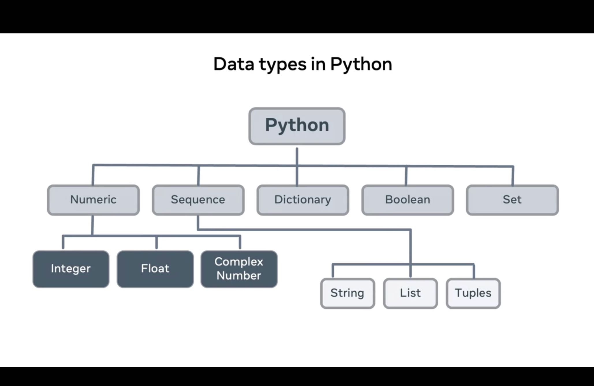

## Flow Control
### Comparison operators


| Operator    | Meaning | Example    |
| ------------- | ------------- | -------- |
| ==        | Equals      | a == b |
| !=      | Not Equal      | a != b |
| <        | Less than      | a <> b |
| >        | Greater than     | a > b |
| <=        | Less than or Equal to      | a <>= b |
| >=        | Greater than or Equal to     | a >= b |


### Built-in Functions
 `print()`
- This function looks for the default output device, your terminal, and displays the value passed to it.
```` 
print("Hello")
````

 `input()`
- This function looks for the default input device, your keyboard, and captures the value. This value can then be assigned or used.
```` 
print("Where do you live?")
location = input()
print("So you live in " + location)
````
 `len()`
- This function returns the length or the count of the elements contained within the structure it is applied on. This may be a string, array, list, tuple, dictionary or any sequence.
```` 
len("Hello")
5
````


 `str()`
- This function can be used to convert the provided value into a String
```` 
str(55)
'55'

````


 `int()`
- This function can be used to convert the provided value into an int
```` 
int('75')
75
````


 `float()`
- This function can be used to convert the provided value into a float
```` 
some_int = 10
float(some_int)
10.0
````

 `Creating Functions`
- Functions in Python require a keyword to define them : def   followed by an identifier (a name) this forms the function signature. The body of the function contains the code to run when the function is called.
```` 
def say_hello():
    return "Hello there!"

# With parameters
def say_hello(you):
    return "Hello " +  you
````

## Type casting
````
# Casting = Specify a type on to a variable.
# Strings
x = str("s1") # x will be 's1'
y = str(2)    # y will be '2'
z = str(3.0)  # z will be '3.0'
# Ints
x = int(1)   # x will be 1
y = int(2.8) # y will be 2
z = int("3") # z will be 3
# Floats
x = float(1)     # x will be 1.0
````


## User input, console output

````
# How to print in Python
print("Hello World!")
# How to print multiple words using comma separator
print("Hi", "there")
# How to separate the objects if there is more than one.
print("Chelsea","Liverpool", sep="-vs-")
#Specify what to print at the end. Default is '\n'
print("Hello World",end="!") 
# or use empty string "" for no new line
print("Hello World",end="")
````
## control flow 
control flow are of `Conditional`,`Loops` and `match statement` types
### if/else
````
# How conditions work
if condition:
	# if condition met
	# code here
elif condition2: # (else if) checked if the first condition is false
  	# if condition2 met
    # code here
elif condition3: # elif can be chained
    # if condition3 met
	# code here
else:
  	# if none of the conditions are met
    # code here

    
# example

if name == "bob": # ex. a == b (is a equal to b)
    print("the wifi password is 1234")
    
elif name == "jake": # if the first condition is not met python checks this one
    print("the secret formula is under the bed")

else: # if none of the conditions are met
    print("sorry i don't know who you are")

    
# Other Example
if age >= 18:
    print('You can go in')
else:
    print('you cannot pass, you are underage')
````

## loops in python
There are two types of loops in Python, for and while.

### While Loop in Python
````
# Python program to illustrate
# while loop
count = 0
while (count < 3):
	count = count + 1
	print("Hello Geek")
````
### Using else statement with while loops
````
# Python program to illustrate
# combining else with while
count = 0
while (count < 3):
	count = count + 1
	print("Hello Geek")
else:
	print("In Else Block")
````

## For Loop in Python
````
for iterator_var in sequence:
    statements(s)

# Python program to illustrate
# Iterating over range 0 to n-1

n = 4
for i in range(0, n):
	print(i)
````
````
# Python program to illustrate
# Iterating over a list
print("List Iteration")
l = ["geeks", "for", "geeks"]
for i in l:
	print(i)

# Iterating over a tuple (immutable)
print("\nTuple Iteration")
t = ("geeks", "for", "geeks")
for i in t:
	print(i)

# Iterating over a String
print("\nString Iteration")
s = "Geeks"
for i in s:
	print(i)

# Iterating over dictionary
print("\nDictionary Iteration")
d = dict()
d['xyz'] = 123
d['abc'] = 345
for i in d:
	print("%s %d" % (i, d[i]))

# Iterating over a set
print("\nSet Iteration")
set1 = {1, 2, 3, 4, 5, 6}
for i in set1:
	print(i),

````

````
solution
List Iteration
geeks
for
geeks

Tuple Iteration
geeks
for
geeks

String Iteration
G
e
e
k
s

Dictionary Iteration
xyz  123
abc  345
````
## Nested Loops
Syntax: 

````
for iterator_var in sequence:
   for iterator_var in sequence:
       statements(s)
       statements(s)

while expression:
   while expression: 
       statement(s)
       statement(s)
````

### Continue Statement:
### Break Statement: 
### Pass Statement:

## Match statement
````
# _ is the symbol for wildcard
match value:
  case Case1:
    ...
  case Case2:
    ...
  case (5, _): # if value is some tuple with first element 5
    ...
  case _: # you can implement a fall-through like this
    ...
````
##  function 
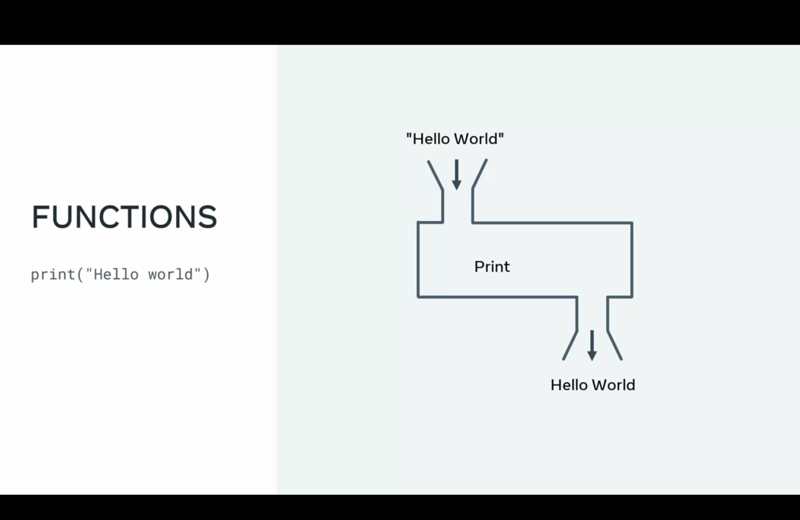
````
def myFunction(say): #you can add variables to the function
  print(say)

myFunction("Hello")

age = input("How old are you?")

myFunction("You are {} years old!".format(age))

#this is what you get:

Hello
How old are you?
>>11 #lol my real age actually
You are 11 years old!
````
## Function and variable scope
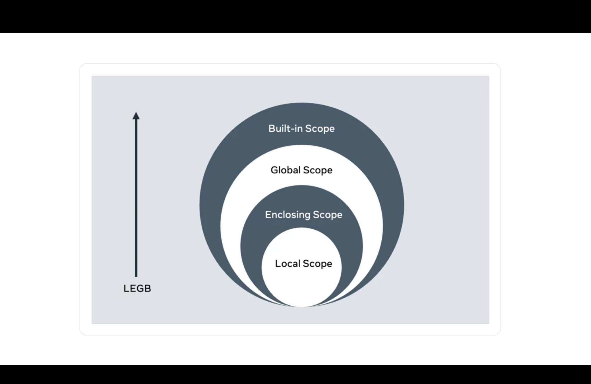
It is essential to understand the levels of scope in Python and how things can be accessed from the four different scope levels. Below are the four scope levels and a brief explanation of where and how they are used.

### 1. Local scope
Local scope refers to a variable declared inside a function. For example, in the code below, the variable total is only available to the code within the get_total function. Anything outside of this function will not have access to it.
````
def get_total(a, b):
    #local variable declared inside a function
    total = a + b;
    return total

print(get_total(5, 2))
7

# Accessing variable outside of the function:
print(total)
NameError: name 'total' is not defined
````
## 2. Enclosing scope
Enclosing scope refers to a function inside another function or what is commonly called a nested function. 

In the code below, I added a nested function called double_it to the get_total function. 

As double_it is inside the scope for the get_total function it can then access the variable. However, the enclosed variable inside the double_it function cannot be accessed from inside the get_total function.
````
def get_total(a, b):
    #enclosed variable declared inside a function
    total = a + b

    def double_it():
        #local variable
        double = total * 2
        print(double)

    double_it()
    #double variable will not be accessible
    print(double)

    return total
````
## 3. Global scope
Global scope is when a variable is declared outside of a function. This means it can be accessed from anywhere. 

In the code below, I  added a global variable called special. This can then be accessed from both functions get_total and double_it:
````

special = 5

def get_total(a, b):
    #enclosed scope variable declared inside a function
    total = a + b
    print(special)

    def double_it():
        #local variable
        double = total * 2
        print(special)

    double_it()

    return total
````
## 4. Built-in scope
Built-in scope refers to the reserved keywords that Python uses for its built-in functions, such as print, def, for, in, and so forth.  Functions with built-in scope can be accessed at any level.

## What are data structures?
This reading introduces you to data structures. So far, you have only stored small bits of data in a variable. This was either an integer, Boolean or a string. 

But what happens if you need to work with more complex information, such as a collection of data like a list of people or a list of companies? 

Data structures are designed for this very purpose.
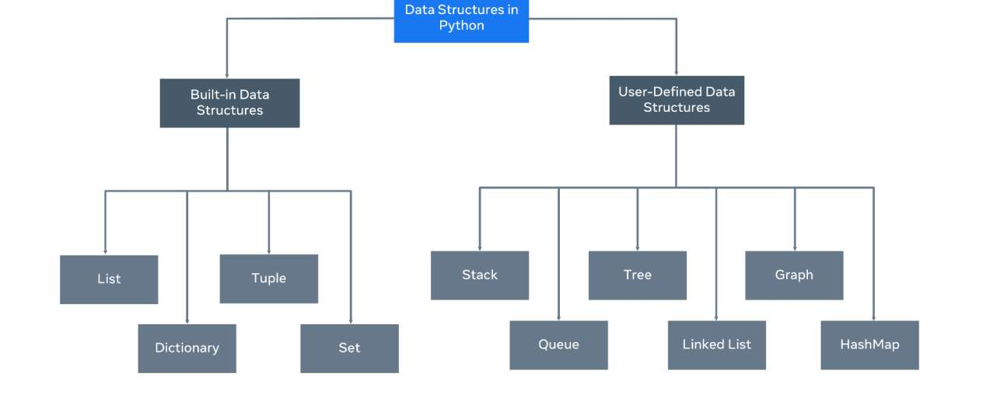

A data structure allows you to organize and arrange your data to perform operations on them. Python has the following built-in data structures: List, dictionary, tuple and set. These are all considered non-primitive data structures, meaning they are classed as objects, this will be explored later in the course. 

Along with the built-in data structures, Python allows users to create their own. Data structures such as Stacks, Queues and Trees can all be created by the user. 

Each data structure can be designed to solve a particular problem or optimize a current solution to make it much more performant.

## Mutability and Immutability
Data Structures can be mutable or immutable. The next question you may ask is, what is mutability? Mutability refers to data inside the data structure that can be modified. For example, you can either change, update, or delete the data when needed. A list is an example of a mutable data structure. The opposite of mutable is immutable. An immutable data structure will not allow modification once the data has been set. The tuple is an example of an immutable data structure.
## list
````
rishabh_marks = [100,100,100,99]

# way to print list 
print(*rishabh_marks)                           # 100 100 100 99
print(rishabh_marks)                            # [100, 100, 100, 99]

# Add element at the end
rishabh_marks.append(1741)
print(rishabh_marks)                            # [100, 100, 100, 99, 1741]

# Add element at a index
rishabh_marks.insert(10,88) 
print(rishabh_marks)                            # 100 100 100 99 1741 88

# add more then 2 element at the end of the array
rishabh_marks.extend([10,20,30])
print(rishabh_marks)                            # [100, 100, 100, 99, 1741, 88, 10, 20, 30]
````
### Removed Element from the list

````
rishabh_marks = [100,98,97,99]

rishabh_marks.pop(1)
print(rishabh_marks)            #[100, 97, 99]

del rishabh_marks[0]
print(rishabh_marks)            #[97, 99]
````
### ITERATE
````
rishabh_marks = [100,98,97,99]

for x in rishabh_marks:
    print(x)
````

## Tuples in Python
Python Tuple is a collection of objects separated by commas. In some ways, a tuple is similar to a list in terms of indexing, nested objects, and repetition but a tuple is immutable, unlike lists which are mutable.

````
var = ("Geeks", "for", "Geeks")
print(var)
````
## Accessing Values in Python Tuples
 ### Method 1: Using Positive Index
````
friends_name =("rishabh","kumar","sadaf","rohit","dinesh","sakshi","maghna")
print(friends_name[1])
````
## Concatenation of Python Tuples
To concatenate the Python tuple we will use plus operators(+).

## Nesting of Python Tuples
````
# Code for creating nested tuples

tuple1 = (0, 1, 2, 3)
tuple2 = ('python', 'geek')
tuple3 = (tuple1, tuple2)
print(tuple3)
````
## Slicing Python Tuples
````
# code to test slicing

tuple1 = (0 ,1, 2, 3)
print(tuple1[1:]) .    //(1, 2, 3)
print(tuple1[::-1]) .  //(3, 2, 1, 0)
print(tuple1[2:4])     //(2, 3) 
````
##  Converting list to a Tuple
````
# Code for converting a list and a string into a tuple

list1 = [0, 1, 2]
print(tuple(list1))                        //(0, 1, 2)
print(tuple('python')) # string 'python'   //('p', 'y', 't', 'h', 'o', 'n')
````
# Sets in Python
A Set is an unordered collection data type that is iterable, mutable and has no duplicate elements. 

````
    - Set are represented by { } (values enclosed in curly braces)
    - This is based on a data structure known as a hash table. Since sets are unordered, we cannot access items using indexes like we do in lists.

    student_position = {1,2,3,5}
    print(student_position)         //{1, 2, 3, 5}
````
## ADD ELEMENT IN SET
````
    student_position.add("rishabh")
    print(student_position)             //{1, 2, 3, 5, 'rishabh'}
````
## Methods for Sets
-


# What are exceptions
### Handle single exception
````
def div(x,y):
    print(x/y)

try:
    div(2,0)
except:
    print("error is come")

````

````
def div(x,y):
    print(x/y)


try:
    div(2,0) 
except Exception as e:
    print(e)

````
### Handle Multiple line exception
````
def div(x,y):
    print(x/y)


try:
    div(2,1)
except ZeroDivisionError as e:
    print(e)
except Exception as e:
    print("something went wrong")
````


## Types of Errors
- IndexError
- ZeroDivisionError
- FileNotFoundError

# File handling in python
Where are two function in pyhton `open` and `close`
### open()
- open function is used for reading writing and Creating files
````
open(file_location,mode) <===== take two arguments
````
The mode indicates what action is required such as reading, writing or creating. It's also specifies if you want the file output in text or binary format.

- 'r'  open and read (text format)
- 'rb' open and read (binary format)
- r+ open for reading and writing 
- 'w' open file for writing 
- 'a' open for editing or appending data


### close()
close function do't take any arguments

## Other Method for open files (With)
with the help of with file will automatically closed
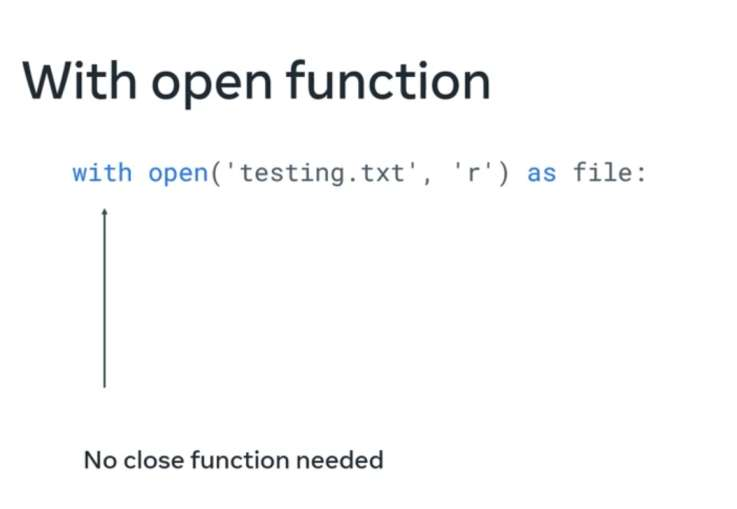

````
file = open('text.txt',mode='r+')
data = file.readline()
print(data)
file.close()
````
````
with open('text.txt',mode='r+') as file:
    data = file.readline()
    print("rishabh")
    print(data)

````
## Creating Files Using python
- we use write() method for writting single line of code 
- we use writelines() method for writting multi lines of code

we can pass list in `file.writelines(["rishabh","\nkumar"])` method

## Read data from the files using python
- read()
- readline()
- readlines()


# PATHS
- `Absolute`
- `Relative`


# Github

## Staging vs. Production
### Development Environments

Every development team prior to releasing their new features or changes needs to verify that the code they do release is not going to cause any issues or bugs. In order to achieve this, they normally set up multiple environments for different ways to test and verify.  A common practice is for teams to have a developer environment, a UAT or QA environment, and a staging environment. The main purpose of this flow is to find any potential issues that may arise due to changes or new features being added to the codebase. The more ways to test the changes the less likely bugs will be introduced.

### Staging
The staging environment should mimic your production environment. The reason for this is because you want to test the code in an environment that matches what you have in production. This allows teams to spot or find any potential issues prior to them getting to production. The closer the staging environment is to your production, the more accurate your testing is going to be. Staging environments can also be used for testing and verifying new features and allow other teams including QA or stakeholders to see and use those features as a pre-trial. Staging should also cover all areas of the architecture of the application including the database and any other services that may be required. Areas that benefit from staging environments include:
### New Features
Developers submitting new features along with feature flags for turning them on and off should always do a testing round in a staging environment. They allow teams to verify that the feature works, it can be turned on and off via configuration flags and also that it does not break or interfere with existing functionality.
### Testing
As the staging environment mimics your production environment, it's also a great place to run tests. QA teams will normally use it to verify new features, configuration changes or software updates/patching. The types of testing covered will be Unit testing, Integration testing and performance testing. All except performance testing can also be carried out in production. Performance can also be completed in production but only at specific times - usually out of hours as it will have a drastic effect on the user experience.

Sometimes it is not always feasible to have an exact replication either due to costs or time. Certain areas can be cut back - for example, if your service is load balanced on 10 virtual machines in production, you could still have 4 virtual machines in staging. The underlying architecture is the same but the overall performance may be different
### Migrations
Staging is a perfect place to test and verify data migrations. Snapshots can be taken from production and used to test your migration scripts to confirm your changes will not break anything. If in the case it does cause an issue, you simply rollback and try again. Doing something like a migration in production is extremely risky and error-prone
### Configuration Changes
Configuration can also cause headaches for teams, especially in a large cloud-based architecture. Having a staging environment will allow you to spot any potential issues or bottlenecks.
### Production
Production is live. It's out there for people to see and/or interact with. Any issues or problems you may have had should have been caught and fixed in the staging environment. The staging area gives the team a safety net to catch these possible issues. Any code that is deployed to production should have been tested and verified before the deployment itself.
### Downtime
Downtime for any service especially customer facing will most likely be revenue impacting. If customers can not access or use your website or app to its full capabilities, it will most likely have a cost involved. Take for example an e-commerce company that allows users to buy goods and services online. If they release a new feature to their shopping cart which actually breaks the payment process, this will have an impact on customers not being able to buy goods online.
### Vulnerabilities
Cyber-security should also play a big role in what gets released in production. Any updates to software such as patching or moving to the latest version should be checked and verified. This is also the same rule for not upgrading software when critical updates are released.
### Reputation
Downtime or issues in production is damaging for a company as it does not instill confidence in end users. If something is down or broken it can cause the company to lose potential customers.

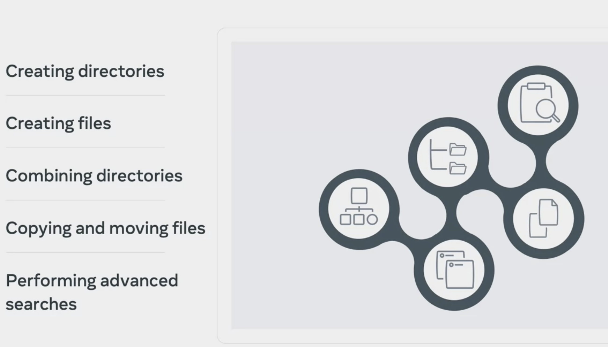
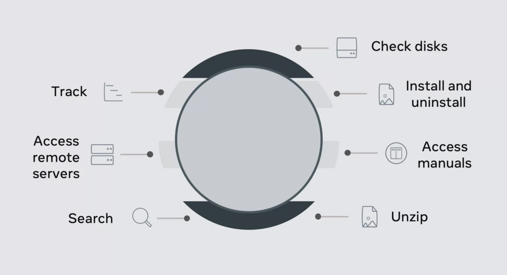
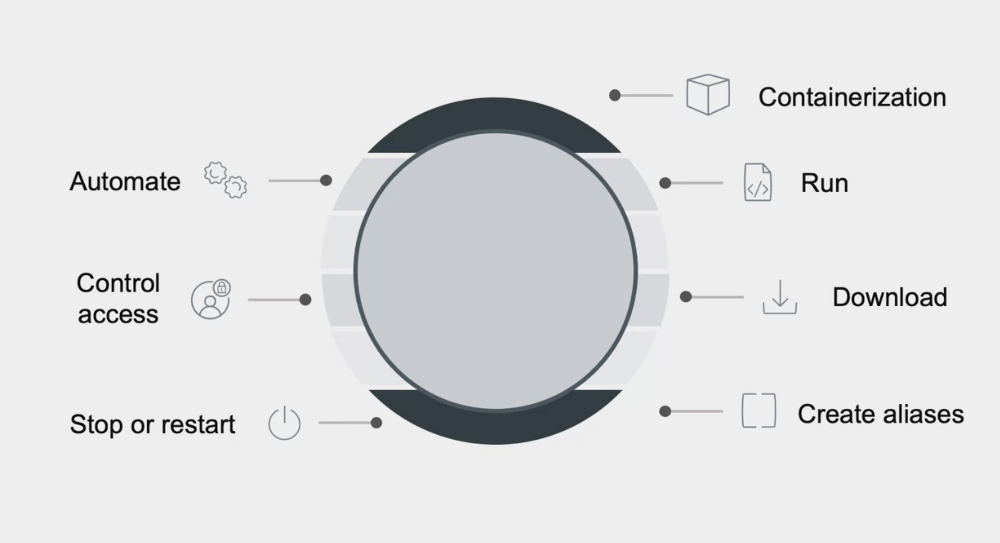

### Termonal cmd
- cd Documents/     => change Directory
- cd ..             ==> move back to Directory
- mkdir word-docs   ==> make directory
- history           ==> show command history
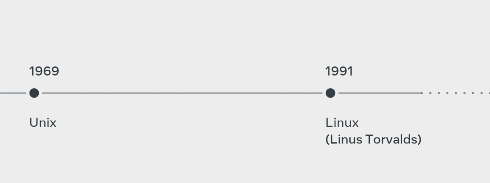
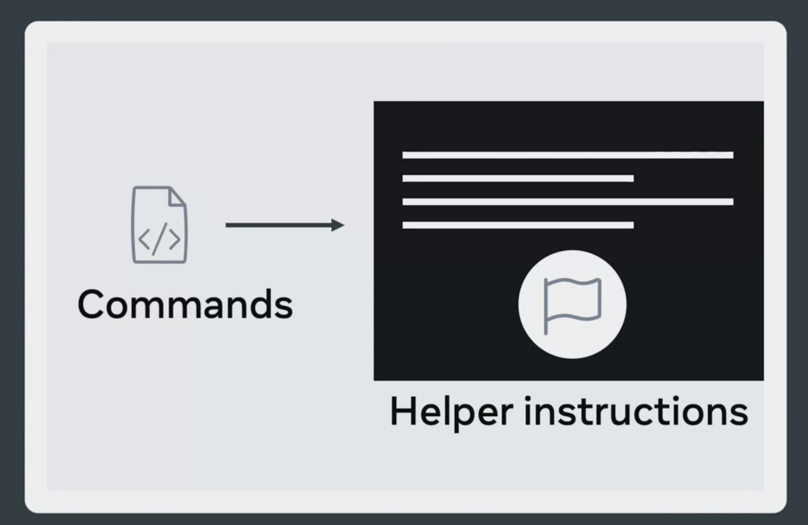
- ls                ==> show contents
- ls -flag          ==> ex ls -l    
- ls -a             ==> show all files enen hidden files also
- pwd               ==> show path directory
- cp                ==> copy 
- mv                ==> move files from one directory to other
### Editing

o edit files in bash you have quiet a few options. The most common though is usually VI or Vim. VI stands for visual editor and it allows you to make edits and changes to a file and save them. Its very similar to what you may have used in applications like word. VIM is a better version of VI with some improvements - hense its name visual editor improved. Learning the different commands in Vim will feel a bit different coming from GUI applications but once you practice it will feel like second nature. Vim uses modes to determine the commands you can work with:

```
- Normal mode: Default mode
- Insert mode: Allows the contents of the files to be edited.
- Command line mode: Normal commands begin with :
```
- cat           => Allows reading or concatenation of a file
- less          => Displays the contents of a file one page at a time.
- grep          => Global regular expression, allows for searching contents of files or folders

### Man Pages
When first starting to learn commands from bash it can feel a bit dauting. Luckily every command comes with its own manual or man pages for short. The man page will list all the flags and options that a particular command has to offer. Again, lets use the ls command to demonstrate this. Type the following:

- man ls

### How to create Script 
````
vim testshell.sh         ==> create file and write bash command in it

#!/bin/bash
echo "hello world"
````
### now the change the mode of file to Execute
- chmod 755 filename.sh


